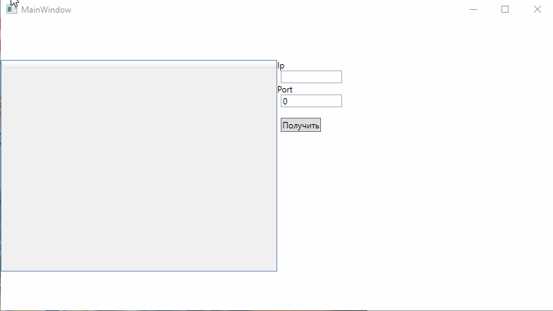
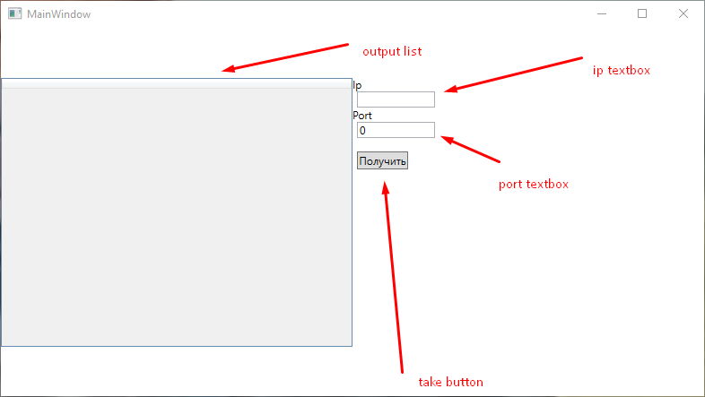
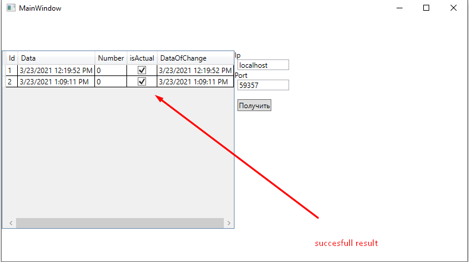
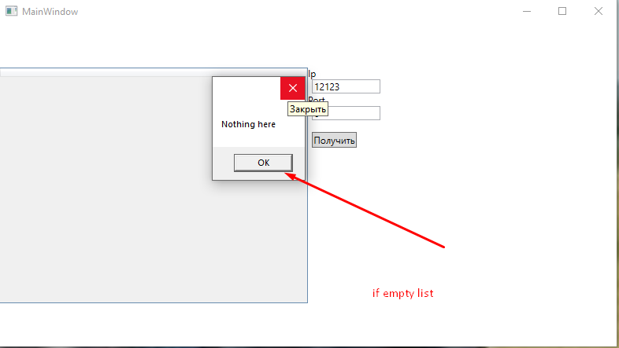
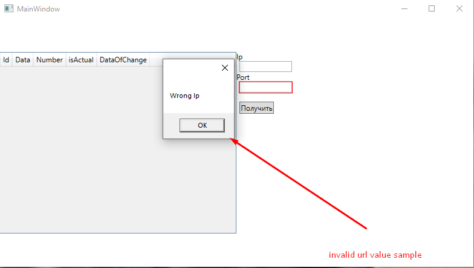

# Bars
This Repository contain Server and wpf client for work with server
## Client 
## example of work

### for client used wpf platform 
### interface of application

### Successfull result (server return code is 200 and json in correct format)

### Empty list message

### Wrong url exception message 

